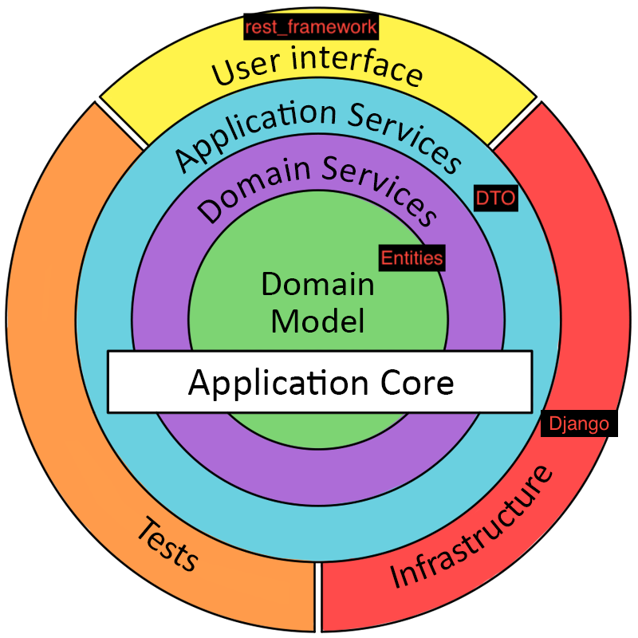

# DDD (Domain-Driven Design)

**Domain-Driven Design (DDD)** is an approach to software development that emphasizes the importance of the domain—the core business logic and rules of the problem you are solving—and models it in a way that closely aligns with real-world concepts. DDD encourages collaboration between technical and domain experts, ensures that the model evolves along with the domain understanding, and places the business logic at the heart of the architecture. The architectural approach often follows a layered or onion-like model, ensuring that the core domain logic remains unaffected by external concerns such as databases, UI frameworks, or messaging systems.

## Domain Layer

The **Domain Layer** lies at the heart of the system. It contains the enterprise rules and business logic. It is pure and independent of any external details like database frameworks or network layers.

### Entities
**Entities** are objects that are identified by their identity (e.g., an `ID`) rather than their attributes. Their identity spans the lifecycle of the object, meaning even if their attributes change, they are still recognized as the same entity. For example, a `Customer` entity remains the same entity even if the customer's address or name changes.

### Value Objects
**Value Objects** are characterized only by their attributes and do not possess a conceptual identity. They are often immutable and can be interchanged if their attributes are equal. For instance, `Address`, `Money`, or `Email` can be considered Value Objects. If two `Money` objects hold the same amount and currency, they are considered equivalent.

### Domain Services
**Domain Services** encapsulate domain logic that doesn’t naturally belong to a single Entity or Value Object. They often operate on multiple Entities and Value Objects. An example is a **discount calculation service** that determines a discount based on a customer's purchase history and current order details.

### Repositories
**Repositories** provide a collection-like interface for accessing domain objects. They abstract away the underlying persistence mechanisms. In the domain layer, repositories are defined as interfaces without implementation details. For example, an `ICustomerRepository` interface might allow you to retrieve, add, or remove customers, but the domain does not care whether these customers are stored in a database, a file, or an external service.

## Application Layer

The **Application Layer** orchestrates the use of the domain logic to fulfill system use cases. It manages application tasks, often by using Domain Services and coordinating domain objects. It is responsible for application-level logic but does not contain business rules or domain-specific logic itself.

### Services
**Application Services** can manage application state and typically coordinate domain operations. They may call Domain Services, manipulate Entities and Value Objects through repositories, and finally return the result to the caller as DTOs. For example, a `UserRegistrationService` might validate input, call a domain service for domain logic, persist a new `User` entity, and return a `UserDTO`.

### DTO - Data Transfer Objects
**DTOs** (Data Transfer Objects) are simple data containers used to transfer data across boundaries such as between the Application Layer and the UI Layer. They contain no business logic and are used solely to transport data. For example, `UserDTO` might include a user’s `name`, `email`, and `status` for display in a user interface.

## Infrastructure Layer

The **Infrastructure Layer** provides the technical capabilities that other layers rely on. It contains concrete implementations of interfaces defined in the domain and application layers, such as database interactions, file systems, messaging, and external APIs.

### Repositories
**Infrastructure Repositories** implement the repository interfaces defined in the domain. For example, `CustomerRepository` might implement `ICustomerRepository` and handle the logic for retrieving or saving `Customer` entities in a relational database, a NoSQL store, or the cloud.

### DAO - Data Access Objects
**DAOs** (Data Access Objects) offer low-level data access operations (CRUD) for specific persistence mechanisms. They help implement the repository methods in a DRY (Don’t Repeat Yourself) manner. For instance, a `CustomerDAO` might handle the actual SQL queries and result set mappings, while the `CustomerRepository` orchestrates these DAOs to fulfill domain-level persistence needs.

## User Interface Layer

The **User Interface Layer** (or Presentation Layer) is where the system interacts with external users or other systems. It might include endpoints, controllers, views, templates, or GraphQL resolvers. The UI layer takes incoming requests, delegates the required operations to Application Services, and returns responses in a user-friendly format.

Examples of UI components include:

- **Controllers/Endpoints**: Handle HTTP requests, forward them to the appropriate application service, and return responses (JSON, HTML, XML, etc.).
- **Views/Templates**: Present data to users in a readable format, often as web pages or mobile UI components.